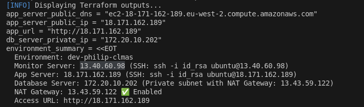
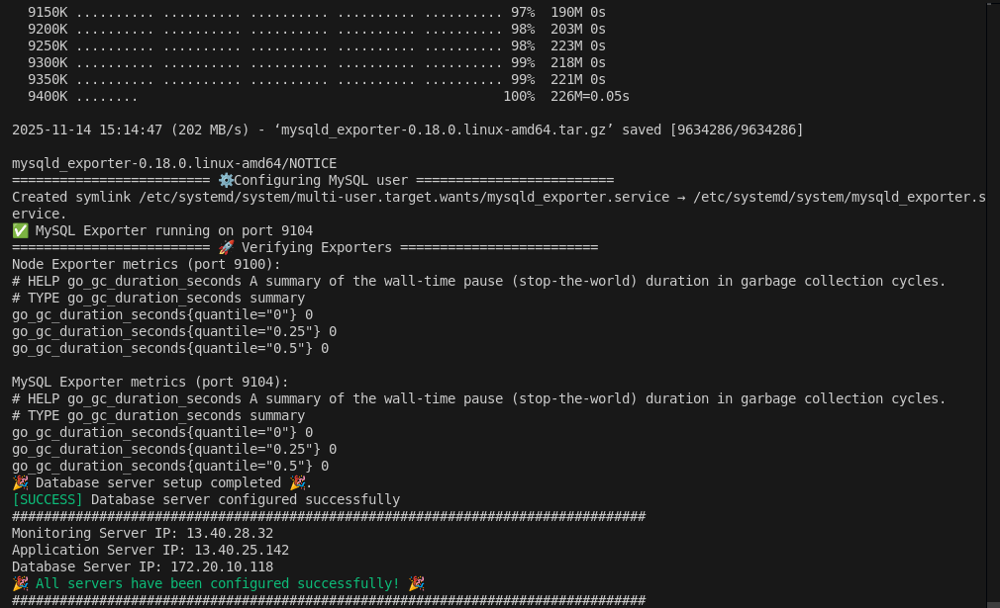
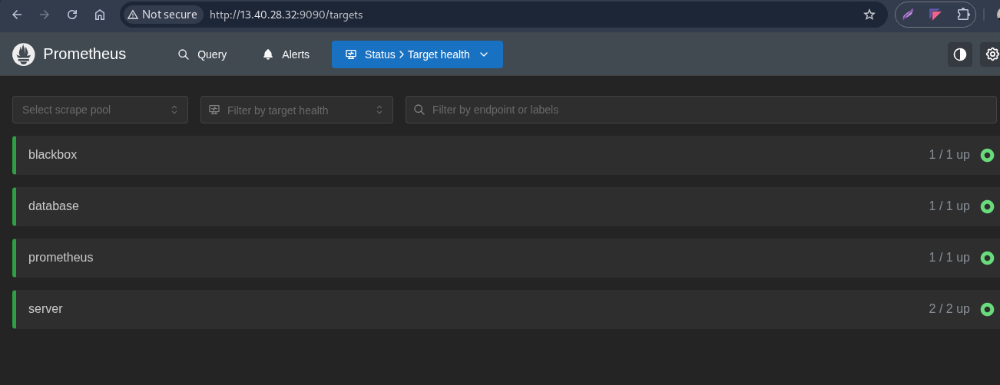
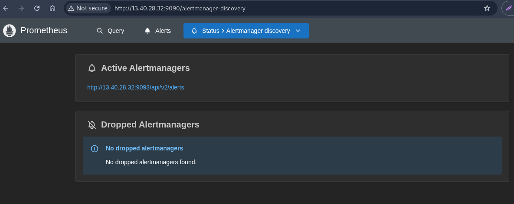
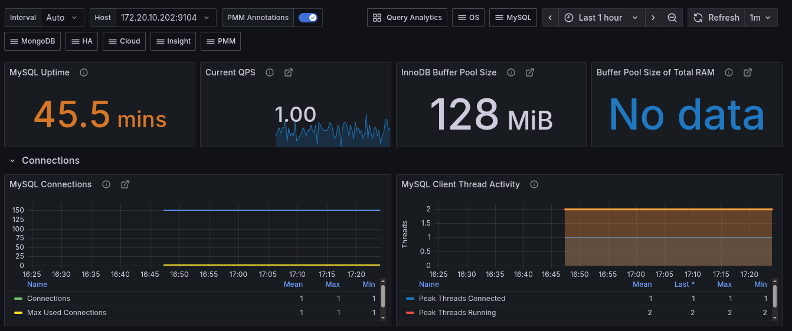
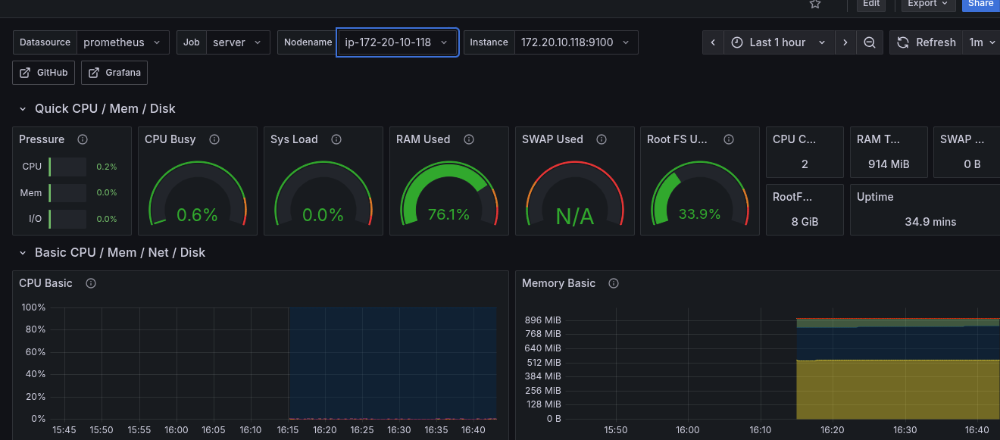
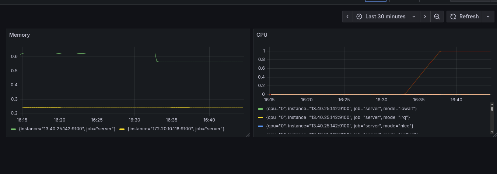
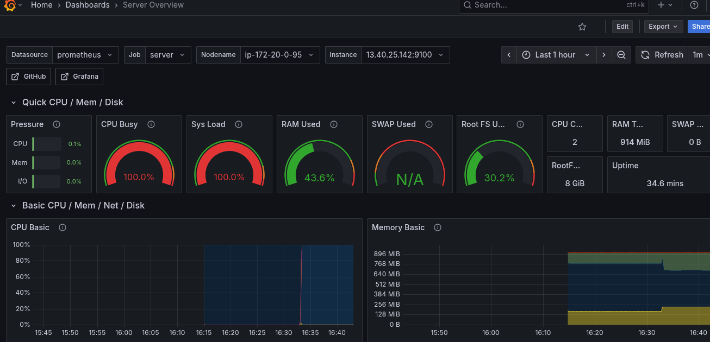

# 🧭 Centralized Logging, Monitoring & Alerting System (CLMAS)

A production-grade **monitoring and alerting system** built using **Prometheus** and **Grafana** to provide real-time visibility into the health, performance, and availability of **web servers** and **database servers**.


---

## 📘 Table of Contents

1. [Overview](#-overview)
2. [Architecture](#-architecture)
3. [Features](#-features)
4. [Tech Stack](#-tech-stack)
5. [Project Structure](#-project-structure)
6. [Setup and Installation](#-setup-and-installation)
7. [Dashboards](#-dashboards)
8. [Alerting](#-alerting)
9. [Security Recommendations](#-security-recommendations)
10. [Troubleshooting](#-troubleshooting)
11. [Future Enhancements](#-future-enhancements)
12. [Conclusion](#-conclusion)

---

## 🧩 Overview

This project implements a **centralized monitoring and alerting solution** using:

- **Prometheus** for metrics collection and alerting.
- **Grafana** for visualization and dashboarding.
- **Prometheus exporters** for collecting system, application, and database metrics.

The goal is to:

- Monitor **application and database server** health, performance, and availability.
- Visualize key metrics in **Grafana dashboards**.
- Receive real-time **alerts** when system thresholds are breached.

---

## 🏗️ Architecture

```text
                ┌──────────────────────────┐
                │        Grafana           │
                │  (Visualization Layer)   │
                └────────────┬─────────────┘
                             │
                             ▼
                ┌──────────────────────────┐
                │       Prometheus         │
                │ (Metrics Collection &    │
                │   Alert Management)      │
                └────────────┬─────────────┘
                             │
         ┌───────────────────┼───────────────────┐
         ▼                   ▼                   ▼
 ┌────────────┐       ┌────────────┐       ┌────────────┐
 │NodeExporter│       │DB Exporter │       │Blackbox Exp│
 │(System)    │       │(MySQL/PG)  │       │(Web Health)│
 └─────┬──────┘       └────┬──────┘       └────┬───────┘
       │                   │                   │
   App Server         Database Server      External Endpoints
```

---

## 🚀 Features

✅ **Comprehensive Monitoring**

- Application servers, database servers, and system-level metrics.
- Uptime, latency, CPU, memory, disk usage, and query performance.

✅ **Real-Time Visualization**

- Custom and predefined Grafana dashboards for each monitored component.
- Drill-down views for historical trend analysis.

✅ **Alerting and Notifications**

- Prometheus **Alertmanager** configured for:

  - **Slack** alerts.
  - Severity levels (warning/critical).

✅ **Scalable and Extensible**

- Easily add new targets or exporters.
- Supports federation and high availability.

---

## 🧰 Tech Stack

| Component             | Description                                      |
| --------------------- | ------------------------------------------------ |
| **Prometheus**        | Metrics collection and alerting                  |
| **Grafana**           | Visualization and dashboarding                   |
| **Node Exporter**     | Collects OS-level metrics                        |
| **MySQL Exporter**    | Collects database-specific metrics               |
| **Blackbox Exporter** | Monitors HTTP endpoints (availability & latency) |
| **Alertmanager**      | Routes alerts to communication channels          |

---

## 📂 Project Structure

```
clmas/
├── configs/
│   ├── alert.rules.yml         # Custom alerting rules
│   ├── alertmanager.yml        # Alert routing configuration
│   ├── app.sh                  # App server exporter config file
│   ├── db.sh                   # Database server exporter config file
│   ├── monitor.sh              # Monitor server exporter config file
│   ├── prometheus.yml          # Prometheus jobs config file
│   └── index.sh                # Server configuration initialization file
│
├── infra/                      # Infrastructure provisioning setup folder
├── .gitignore                  # Gitignore file
└── README.md                   # Project documentation
```

---

## ⚙️ Setup and Installation

### 🧾 Prerequisites

- Terraform installed and configured.
- Access to target application and database servers.
- Network connectivity between Prometheus and monitored nodes.

### 🏗️ Step-by-Step Setup

1. **Clone the Repository**

   ```bash
   git clone https://github.com/philipoyelegbin/clmas.git
   cd clmas
   ```

2. **Run the Infrastructure Provisioner**

   ```bash
   cd infra
   ./index.sh init
   ./index.sh validate
   ./index.sh apply
   ```

   

3. **Configure the Servers**

   - Update the respective server IPs in the [index file](./configs/index.sh).
   - Update the scrape target IPs in [prometheus.yml](configs/prometheus.yml).
   - Update the Slack API URL in [alertmanager.yml](configs/alertmanager.yml).

   ```bash
   cd configs
   ./index.sh
   ```

   

4. **Access Dashboards**

   - **Grafana:** [http://<MONITORING_SERVER_IP>:3000](http://<MONITORING_SERVER_IP>:3000)
     Default credentials → `admin / admin`
   - **Prometheus:** [http://<MONITORING_SERVER_IP>:9090](http://<MONITORING_SERVER_IP>:9090)
   - **Alertmanager:** [http://<MONITORING_SERVER_IP>:9093](http://<MONITORING_SERVER_IP>:9093)

   
   
   

5. **Create Visuals**

   - Import prebuilt dashboards using the following Grafana IDs:

     - **Node Exporter (Server):** `1860`
     - **MySQL Exporter:** `7362`

   - Create a custom dashboard combining both Node + MySQL panels using queries such as:

     - **CPU:** `rate(node_cpu_seconds_total{mode!="idle"}[5m])`
     - **Memory:** `node_memory_MemAvailable_bytes / node_memory_MemTotal_bytes`
     - **QPS:** `rate(mysql_global_status_queries[1m])`
     - **Connections:** `mysql_global_status_threads_connected`
     - **Buffer Pool:** `mysql_global_status_innodb_buffer_pool_pages_free`

---

## 📊 Dashboards

Dashboards included:

1. **App Server Overview** – latency, request rate, uptime.
2. **Database Performance** – query time, connections, replication.
3. **System Metrics** – CPU, memory, disk, and network.
4. **Alert Summary** – active alerts and history.

Grafana dashboards can be imported manually or auto-provisioned via JSON files.





---

## 🚨 Alerting

Test your alert setup by running the command below to stress the app server:

```bash
ssh -i ../infra/id_rsa ubuntu@<APP_SERVER_IP> "sudo apt install stress -y && stress --cpu 2"
```





---

## 🔒 Security Recommendations

- **Authentication:** Enable Grafana user management and RBAC.
- **Firewall Rules:** Restrict Prometheus access to trusted IPs only.
- **Secrets Management:** Use `.env` files or Vault for credentials.
- **HTTPS:** Recommended for Grafana and Prometheus endpoints.

**🚀 Live Demo:**
https://github.com/user-attachments/assets/85968545-1086-495e-bad3-bfd3b2e97bf1

---

## 🧠 Troubleshooting

| Issue                 | Possible Cause               | Solution                                        |
| --------------------- | ---------------------------- | ----------------------------------------------- |
| No metrics in Grafana | Wrong Prometheus data source | Recheck data source in Grafana settings         |
| Missing metrics       | Exporter not reachable       | Check network/firewall and target configuration |
| Alerts not firing     | Misconfigured alert rules    | Validate syntax using `promtool check rules`    |

---

## 🛠️ Future Enhancements

- Integration with **Loki** or **ELK Stack** for centralized logging.
- Add **machine learning-based anomaly detection**.
- Support **Kubernetes monitoring** via kube-state-metrics.
- Implement **self-healing scripts** for automated remediation.

---

## 🏁 Conclusion

The **Centralized Logging, Monitoring & Alerting System (CLMAS)** provides a complete, production-ready observability stack.
By combining **Prometheus**, **Grafana**, and **Alertmanager**, it enables proactive system health monitoring, real-time visualization, and instant alerting across distributed infrastructure.

This setup ensures higher system reliability, faster incident response, and better visibility for DevOps teams — forming a strong foundation for scalable cloud infrastructure monitoring.

---
