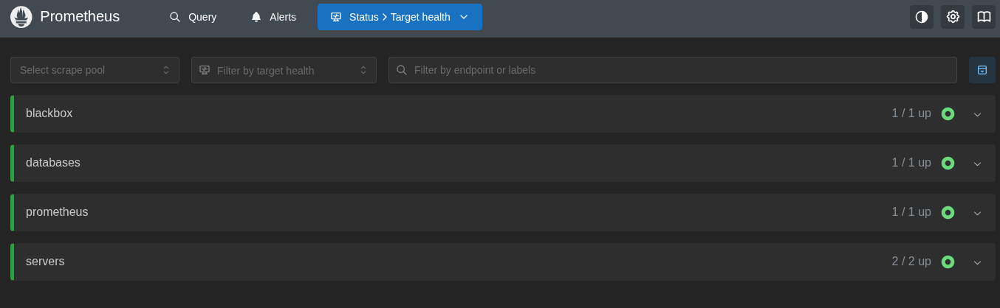
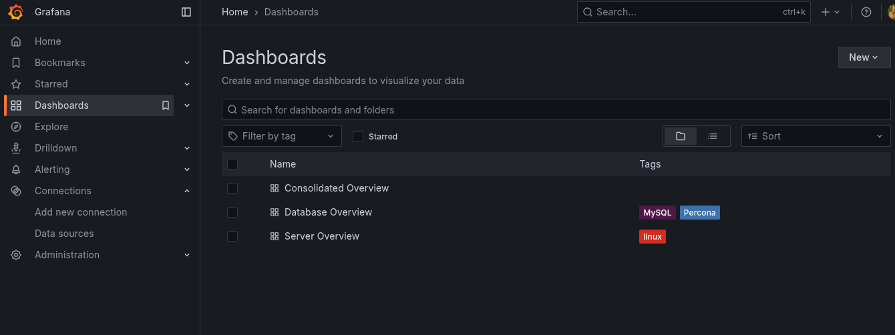
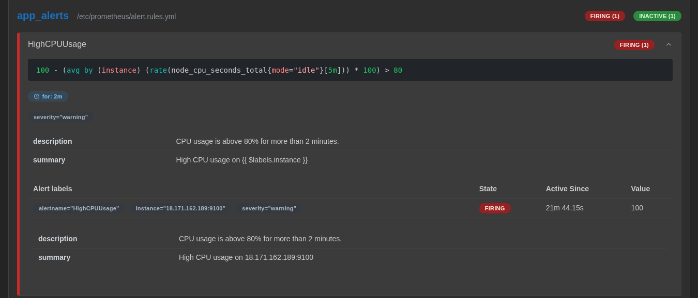

# 🧭 Centralized Logging, Monitoring & Alerting System (CLMAS)

A production-grade **monitoring and alerting system** built using **Prometheus** and **Grafana** to provide real-time visibility into the health, performance, and availability of **web servers** and **database servers**.


---

## 📘 Table of Contents

1. [Overview](#overview)
2. [Architecture](#architecture)
3. [Features](#features)
4. [Tech Stack](#tech-stack)
5. [Project Structure](#project-structure)
6. [Setup and Installation](#setup-and-installation)
7. [Dashboards](#dashboards)
8. [Alerting](#alerting)
9. [Security Recommendation](#security)
10. [Troubleshooting](#troubleshooting)
11. [Future Enhancements](#future-enhancements)

---

## 🧩 Overview

This project implements a **centralized monitoring and alerting solution** using:

- **Prometheus** for metrics collection and alerting.
- **Grafana** for visualization and dashboarding.
- **Prometheus exporters** for collecting system, app server, and database metrics.

The goal is to:

- Monitor **app and database server health**, performance, and availability.
- Visualize key metrics in **Grafana dashboards**.
- Receive real-time **alerts** when system thresholds are breached.

---

## 🏗️ Architecture

```text
                ┌──────────────────────────┐
                │        Grafana           │
                │  (Visualization Layer)   │
                └────────────┬─────────────┘
                             │
                             ▼
                ┌──────────────────────────┐
                │       Prometheus         │
                │ (Metrics Collection &    │
                │   Alert Management)      │
                └────────────┬─────────────┘
                             │
         ┌───────────────────┼───────────────────┐
         ▼                   ▼                   ▼
 ┌────────────┐       ┌────────────┐       ┌────────────┐
 │NodeExporter│       │DB Exporter │       │Blackbox Exp│
 │(System)    │       │(MySQL/PG)  │       │(Web Health)│
 └─────┬──────┘       └────┬──────┘       └────┬───────┘
       │                   │                   │
   App Server         Database Server      External Endpoints
```

---

## 🚀 Features

✅ **Comprehensive Monitoring**

- App servers, database servers, and system-level metrics.
- Uptime, latency, CPU, memory, disk, and query performance.

✅ **Real-Time Visualization**

- Custom and Predefined Grafana dashboards for each monitored component.
- Drill-down views for historical trend analysis.

✅ **Alerting and Notifications**

- Prometheus **Alertmanager** configured for:

  - **Slack** alerts.
  - Severity levels (warning/critical).

✅ **Scalable and Extensible**

- Easily add new targets or exporters.
- Supports federation and high availability.

---

## 🧰 Tech Stack

| Component             | Description                                      |
| --------------------- | ------------------------------------------------ |
| **Prometheus**        | Metrics collection and alerting                  |
| **Grafana**           | Visualization and dashboarding                   |
| **Node Exporter**     | Collects OS-level metrics                        |
| **MySQL Exporter**    | Collects DB-specific metrics                     |
| **Blackbox Exporter** | Monitors HTTP endpoints (availability & latency) |
| **Alertmanager**      | Routes alerts to communication channels          |

---

## 📂 Project Structure

```
clmas/
├── config/
│   ├── alert_rules.yml         # Custom alerting rules
│   ├── alertmanager.yml        # Alert routing configuration
│   ├── app.sh                  # App server exporter config file
│   ├── db.sh                   # Database server exporter config file
│   ├── monitor.sh              # Monitor server exporter config file
│   ├── prometheus.yml          # Prometheus jobs config file
│   └── index.sh                # Server configuration initialization file
│
├── infra/                      # Infrastructure provisioning setup folder
├── .gitignore.yml              # Gitignore file
└── README.md                   # Project documentation
```

---

## ⚙️ Setup and Installation

### 🧾 Prerequisites

- Terraoform infrastructure provision
- Access to the target app and database servers
- Network connectivity between Prometheus and monitored nodes

### 🏗️ Step-by-Step Setup

1. **Clone the Repository**

```bash
git clone https://github.com/philipoyelegbin/clmas.git
cd clmas
```

2. **Run the Infrastructure Provisioner**

```bash
cd infra
./index.sh init            # Initialize terraform
./index.sh validate        # Validate terraoform script
./index.sh apply           # Create the infrastructure
```


3. **Configure the Servers**

- Update the respective server IP for each functions in [index file](./config/index.sh).
- Update the scrape targets server IP in [prometheus file](config/prometheus.yml):
- Update the slack api url in [alertmanager file](config/alertmanager.yml):

```bash
cd config
./index.sh app            # Configure app server exporter
./index.sh database       # Configure database server exporter
./index.sh monitor        # Configure monitor server exporter
```

4. **Access Dashboards**

   - **Grafana:** [http://localhost:3000](http://localhost:3000)
     Default credentials → `admin / admin`
   - **Prometheus:** [http://localhost:9090](http://localhost:9090)
   - **Alertmanager:** [http://localhost:9093](http://localhost:9093)

   
   
   

5. **Create Vituals**

   - Import a prebuilt dashboard using the IDs for MySQL and Node (7362 and 1860) repectively
   - Create a single custom dashboard combining both Node + MySQL panels using the query below:
     - CPU: rate(node_cpu_seconds_total{mode!="idle"}[5m])
     - Memory: node_memory_MemAvailable_bytes / node_memory_MemTotal_bytes
     - QPS: rate(mysql_global_status_queries[1m])
     - Connections: mysql_global_status_threads_connected
     - Buffer Pool: mysql_global_status_innodb_buffer_pool_pages_free

---

## 📊 Dashboards

Dashboards included:

1. **App Server Overview** – latency, request rate, uptime
2. **Database Performance** – query time, connections, replication
3. **System Metrics** – CPU, memory, disk, network
4. **Alert Summary** – active alerts and history

Grafana dashboards can be imported manually or auto-provisioned via JSON files.




---

## 🚨 Alerting

Test your alert by running the command below to stress your app server.

```bash
ssh -i ../infra/id_rsa ubuntu@13.40.69.226 "sudo apt install stress -y && stress --cpu 2"
```



---

## 🔒 Security Recommendation

- **Authentication:** Enable Grafana user management and RBAC.
- **Firewall Rules:** Restrict Prometheus access to trusted IPs only.
- **Secrets Management:** Use `.env` files or Vault for credentials.
- **HTTPS** recommended for Grafana and Prometheus endpoints.

**🚀 Live Demo:**

https://github.com/user-attachments/assets/60c1e174-c908-4e7f-9a5d-0b8c10418f95


---

## 🧠 Troubleshooting

| Issue                 | Possible Cause               | Solution                                        |
| --------------------- | ---------------------------- | ----------------------------------------------- |
| No metrics in Grafana | Wrong Prometheus data source | Recheck datasource in Grafana settings          |
| Missing metrics       | Exporter not reachable       | Check network/firewall and target configuration |
| Alerts not firing     | Misconfigured alert rules    | Validate syntax using `promtool check rules`    |

---

## 🛠️ Future Enhancements

- Integration with **Loki** or **ELK Stack** for centralized logging.
- Add **machine learning-based anomaly detection**.
- Support **Kubernetes monitoring** via kube-state-metrics.
- Implement **self-healing scripts** for automated remediation.

---
